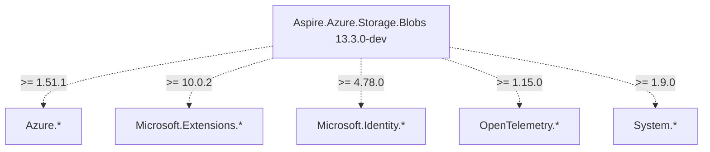

# dotnet-pkgs-ai-docs

Generate AI-ready documentation from NuGet packages — no source code required.

Given a set of `.nupkg` files, `dotnet-pkgs-ai-docs` produces:
- **Transitive dependency graphs** — full closure per target framework, with Mermaid diagrams
- **Public API surface** — every public type and member, per target framework

The output is structured Markdown optimized for AI coding agents (GitHub Copilot,
Copilot SWE Agent, Claude, etc.) but equally useful for humans.

## Why?

AI agents migrating codebases between SDK versions need two things:
1. **What packages does a library bring in?** Not just direct deps — the full transitive tree,
   so the agent knows what to add, remove, or upgrade.
2. **What types and methods are available?** So the agent can write correct code
   without guessing or crawling the NuGet cache.

No existing tool answers these questions from `.nupkg` files:
- `dotnet list package --include-transitive` requires source code and works per project
- NuGet Package Explorer is GUI-only, not batch or machine-readable
- GenAPI needs a build context, not release artifacts
- No tool analyzes a *set* of packages together showing cross-package relationships

This tool takes the release artifacts themselves and produces documentation that agents can consume.

## Installation

```bash
dotnet tool install --global dotnet-pkgs-ai-docs
```

Or build from source:

```bash
git clone https://github.com/jmprieur/pkgs-ai-docs.git
cd pkgs-ai-docs
dotnet build
```

## Usage

### Transitive dependency graph

```bash
dotnet-pkgs-ai-docs deps ./packages/ -o ./output/
```

For each target framework, generates a `dependencies-{tfm}.md` file containing:
- Mermaid dependency diagram per package
- Classified dependency list (1P vs external)
- Version constraints

Output files: `dependencies-net8.0.md`, `dependencies-net9.0.md`, etc.

### Public API surface

```bash
dotnet-pkgs-ai-docs api ./packages/ -o ./output/
```

For each target framework, generates a `public-api-{tfm}.md` file containing:
- Every public namespace, type, and member per package
- Roslyn `PublicAPI.Shipped.txt` format (one member per line, fully qualified, sorted)

Output files: `public-api-net8.0.md`, `public-api-net9.0.md`, etc.

### Both at once

```bash
dotnet-pkgs-ai-docs all ./packages/ -o ./output/
```

### Options

| Option | Description | Default |
|--------|-------------|---------|
| `-o, --output` | Output directory | `./pkgs-ai-docs-output/` |
| `--source` | Additional NuGet source(s) for transitive resolution | `nuget.org` + local folder |
| `--format` | Output format: `md`, `json`, or `both` | `md` |
| `--1p-prefix` | Package ID prefix(es) to classify as first-party | _(none)_ |

> **Important for private/internal packages:** If your `.nupkg` files depend on other packages
> from private feeds (e.g., Azure DevOps Artifacts), pass `--source` with the feed URL.
> Without it, `dotnet restore` can't resolve transitive dependencies.

### Custom NuGet sources

If your packages depend on packages from private feeds, **you must pass `--source`** so transitive
dependencies can be resolved. The deps command populates the NuGet global cache, which the API
command then uses for assembly resolution.

```bash
dotnet-pkgs-ai-docs all ./packages/ -o ./output/ \
  --source https://pkgs.dev.azure.com/myorg/_packaging/myfeed/nuget/v3/index.json \
  --source https://api.nuget.org/v3/index.json
```

> **Tip:** Always include `https://api.nuget.org/v3/index.json` alongside private sources,
> since packages often depend on public NuGet packages too.

### First-party classification

Group packages by ownership in the dependency output:

```bash
dotnet-pkgs-ai-docs deps ./packages/ -o ./output/ \
  --1p-prefix Microsoft.Identity.ServiceEssentials \
  --1p-prefix Microsoft.Identity.SettingsProvider
```

## Example output

See the [samples/](samples/) folder for full output generated from .NET Aspire 13.3.0-dev packages.

### Dependency graph (`dependencies-net8.0.md` excerpt)

````markdown
## Aspire.Azure.Storage.Blobs 13.3.0-dev



**External packages (pulled in transitively):**
- AspNetCore.HealthChecks.Azure.Storage.Blobs >= 9.0.0
- Azure.Core >= 1.51.1
- Azure.Identity >= 1.17.1
- Azure.Storage.Blobs >= 12.26.0
- Azure.Storage.Common >= 12.25.0
- Microsoft.Extensions.Azure >= 1.13.1
- Microsoft.Extensions.Configuration >= 10.0.2
- Microsoft.Extensions.DependencyInjection >= 8.0.1
- Microsoft.Extensions.Diagnostics.HealthChecks >= 8.0.23
- Microsoft.Extensions.Hosting.Abstractions >= 10.0.2
- Microsoft.Identity.Client >= 4.78.0
- OpenTelemetry >= 1.15.0
- OpenTelemetry.Extensions.Hosting >= 1.15.0
- System.ClientModel >= 1.9.0
````

### Public API (`public-api-net8.0.md` excerpt)

````markdown
## Aspire.Azure.Data.Tables 13.3.0-dev

```
Aspire.Azure.Data.Tables.AzureDataTablesSettings (sealed class)
Aspire.Azure.Data.Tables.AzureDataTablesSettings.AzureDataTablesSettings() -> void
Aspire.Azure.Data.Tables.AzureDataTablesSettings.ConnectionString.get -> System.String
Aspire.Azure.Data.Tables.AzureDataTablesSettings.ConnectionString.set -> void
Aspire.Azure.Data.Tables.AzureDataTablesSettings.ServiceUri.get -> System.Uri
Aspire.Azure.Data.Tables.AzureDataTablesSettings.ServiceUri.set -> void
Microsoft.Extensions.Hosting.AspireTablesExtensions (static class)
```
````

## How it works

### Dependency resolution

1. Extracts `.nuspec` from each `.nupkg` (it's a zip file)
2. Discovers supported target frameworks from `<dependencies>` groups and `lib/` structure
3. Creates a temporary `.csproj` per package × TFM with a single `<PackageReference>`
4. Runs `dotnet restore` with configured NuGet sources (including the input folder as a local source)
5. Parses `obj/project.assets.json` for the complete resolved dependency tree
6. Classifies packages as 1P or external based on `--1p-prefix` rules
7. Generates one `dependencies-{tfm}.md` file per target framework with embedded Mermaid diagrams

### Public API extraction

1. Extracts assemblies from `lib/<tfm>/` inside all `.nupkg` files into a shared reference folder
2. Loads assemblies into `System.Reflection.MetadataLoadContext` (metadata-only, no code execution)
3. Resolves cross-package type references using sibling assemblies, .NET reference assemblies, and the NuGet global cache
4. Handles version mismatches (e.g., placeholder versions like `42.42.42.42`) via name-based assembly resolution
5. Falls back through compatible TFMs when a dependency only ships for a lower framework
6. Excludes types and members marked with `[Obsolete]`
7. Enumerates all public namespaces, types, and members
8. Generates one `public-api-{tfm}.md` file per target framework

## Use with AI agents

The generated Markdown files are designed to be included in AI agent context:
- As **GitHub Copilot skills** — drop the per-TFM files in `.github/skills/`
- As **custom instructions** — reference in `.copilot-instructions.md`
- As **agent context** — include in prompts for migration or upgrade tasks
- One file per TFM keeps context window usage efficient — an agent working on `net8.0` only loads `dependencies-net8.0.md`

## CI/CD Integration

### Azure Pipelines

```yaml
- script: dotnet tool install --global dotnet-pkgs-ai-docs
  displayName: 'Install pkgs-ai-docs'

- script: dotnet-pkgs-ai-docs all $(NugetDirectoryPath)\1P -o $(Build.ArtifactStagingDirectory)\package-metadata --1p-prefix Microsoft.Identity.ServiceEssentials
  displayName: 'Generate package metadata'
  continueOnError: true
```

### GitHub Actions

```yaml
- run: dotnet tool install --global dotnet-pkgs-ai-docs
- run: dotnet-pkgs-ai-docs all ./packages/ -o ./output/
- uses: actions/upload-artifact@v4
  with:
    name: package-metadata
    path: ./output/
```

## Requirements

- .NET SDK 8.0 or later (for `dotnet restore` during dependency resolution)
- Works on Windows, Linux, and macOS

## Contributing

Contributions welcome! Please open an issue to discuss before submitting a PR.

## License

[MIT](LICENSE)

## Authors

Jean-Marc Prieur ([@jmprieur](https://github.com/jmprieur)) — with Bridge (GitHub Copilot)