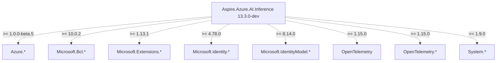
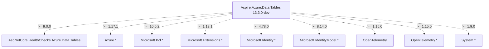
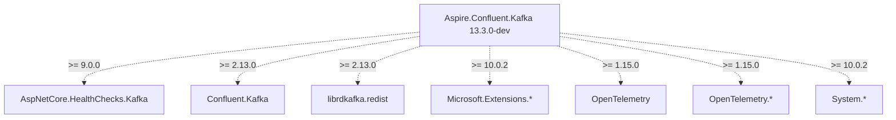

# Sample: Transitive Dependency Graph — net8.0

*Generated from .NET Aspire 13.3.0-dev packages using `dotnet-pkgs-ai-docs`*

This is an excerpt showing 3 packages. The full output contained 92 packages.

---

## Aspire.Azure.AI.Inference 13.3.0-dev

**External packages (pulled in transitively):**
- Azure.AI.Inference >= 1.0.0-beta.5
- Azure.Core >= 1.51.1
- Azure.Identity >= 1.17.1
- Microsoft.Bcl.AsyncInterfaces >= 10.0.2
- Microsoft.Extensions.AI >= 10.2.0
- Microsoft.Extensions.AI.Abstractions >= 10.2.0
- Microsoft.Extensions.AI.AzureAIInference >= 10.0.0-preview.1.25559.3
- Microsoft.Extensions.Azure >= 1.13.1
- Microsoft.Extensions.Caching.Abstractions >= 10.0.2
- Microsoft.Extensions.Configuration >= 10.0.2
- Microsoft.Extensions.Configuration.Abstractions >= 10.0.2
- Microsoft.Extensions.Configuration.Binder >= 10.0.2
- Microsoft.Extensions.DependencyInjection >= 8.0.1
- Microsoft.Extensions.DependencyInjection.Abstractions >= 10.0.2
- Microsoft.Extensions.Diagnostics.Abstractions >= 10.0.2
- Microsoft.Extensions.Diagnostics.HealthChecks >= 8.0.23
- Microsoft.Extensions.Diagnostics.HealthChecks.Abstractions >= 8.0.23
- Microsoft.Extensions.FileProviders.Abstractions >= 10.0.2
- Microsoft.Extensions.Hosting.Abstractions >= 10.0.2
- Microsoft.Extensions.Logging >= 8.0.1
- Microsoft.Extensions.Logging.Abstractions >= 10.0.2
- Microsoft.Extensions.Logging.Configuration >= 8.0.0
- Microsoft.Extensions.Options >= 10.0.2
- Microsoft.Extensions.Options.ConfigurationExtensions >= 8.0.0
- Microsoft.Extensions.Primitives >= 10.0.2
- Microsoft.Identity.Client >= 4.78.0
- Microsoft.Identity.Client.Extensions.Msal >= 4.78.0
- Microsoft.IdentityModel.Abstractions >= 8.14.0
- OpenTelemetry >= 1.15.0
- OpenTelemetry.Api >= 1.15.0
- OpenTelemetry.Api.ProviderBuilderExtensions >= 1.15.0
- OpenTelemetry.Extensions.Hosting >= 1.15.0
- System.ClientModel >= 1.9.0
- System.Diagnostics.DiagnosticSource >= 10.0.2
- System.IO.Pipelines >= 10.0.2
- System.Memory.Data >= 10.0.1
- System.Numerics.Tensors >= 10.0.2
- System.Security.Cryptography.ProtectedData >= 4.5.0
- System.Text.Encodings.Web >= 10.0.2
- System.Text.Json >= 10.0.2
- System.Threading.Channels >= 10.0.2

---

## Aspire.Azure.Data.Tables 13.3.0-dev

**External packages (pulled in transitively):**
- AspNetCore.HealthChecks.Azure.Data.Tables >= 9.0.0
- Azure.Core >= 1.51.1
- Azure.Data.Tables >= 12.11.0
- Azure.Identity >= 1.17.1
- Microsoft.Bcl.AsyncInterfaces >= 10.0.2
- Microsoft.Extensions.Azure >= 1.13.1
- Microsoft.Extensions.Configuration >= 10.0.2
- Microsoft.Extensions.DependencyInjection >= 8.0.1
- Microsoft.Extensions.Diagnostics.HealthChecks >= 8.0.23
- Microsoft.Extensions.Hosting.Abstractions >= 10.0.2
- Microsoft.Extensions.Logging >= 8.0.1
- Microsoft.Extensions.Options >= 10.0.2
- Microsoft.Identity.Client >= 4.78.0
- Microsoft.IdentityModel.Abstractions >= 8.14.0
- OpenTelemetry >= 1.15.0
- OpenTelemetry.Extensions.Hosting >= 1.15.0
- System.ClientModel >= 1.9.0
- System.Diagnostics.DiagnosticSource >= 10.0.2
- System.Memory.Data >= 10.0.1
- System.Security.Cryptography.ProtectedData >= 4.5.0
- System.Text.Json >= 10.0.2

---

## Aspire.Confluent.Kafka 13.3.0-dev

**External packages (pulled in transitively):**
- AspNetCore.HealthChecks.Kafka >= 9.0.0
- Confluent.Kafka >= 2.13.0
- librdkafka.redist >= 2.13.0
- Microsoft.Extensions.Configuration >= 10.0.2
- Microsoft.Extensions.DependencyInjection >= 8.0.0
- Microsoft.Extensions.Diagnostics.HealthChecks >= 8.0.23
- Microsoft.Extensions.Hosting.Abstractions >= 10.0.2
- Microsoft.Extensions.Logging >= 8.0.0
- Microsoft.Extensions.Options >= 10.0.2
- OpenTelemetry >= 1.15.0
- OpenTelemetry.Extensions.Hosting >= 1.15.0
- System.Diagnostics.DiagnosticSource >= 10.0.2
